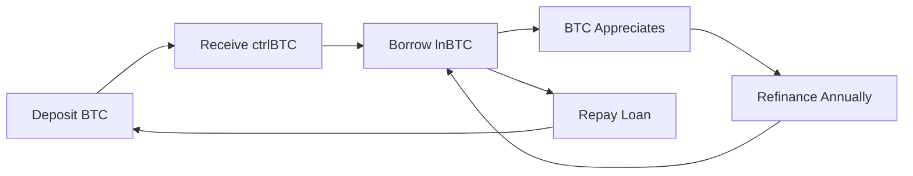

<div align="center">

# 🎯 Qube.xyz
### **Advanced BTC Lending & Borrowing Aggregator Protocol**

*In Collaboration with TesserApt*

[](https://aptoslabs.com)
[](https://move-language.github.io/move/)
[](https://reactjs.org/)
[](https://www.typescriptlang.org/)

**🌐 [Live Demo](#) | 📖 [Documentation](./docs) | 🚀 [Deployment Guide](./DEPLOYMENT_GUIDE.md)**

</div>

---

## 📖 Table of Contents

- [Overview](#-overview)
- [Core Concept](#-core-concept)
- [Architecture](#-architecture)
- [Smart Contracts](#-smart-contracts)
- [Token System](#-token-system)
- [Interest Rate Model](#-interest-rate-model)
- [Frontend Interface](#-frontend-interface)
- [Quick Start](#-quick-start)
- [Development](#-development)
- [Testing](#-testing)
- [Security](#-security)
- [Roadmap](#-roadmap)

---

## 🌟 Overview

**Qube.xyz** is a cutting-edge decentralized lending protocol built on the **Aptos blockchain** that enables users to execute sophisticated **Buy-Borrow-Die (BBD)** strategies using Bitcoin-backed tokens. The platform provides over-collateralized lending with dynamic interest rates, allowing users to maximize capital efficiency while maintaining exposure to BTC appreciation.

### 🎯 Key Features

✅ **Over-Collateralized Lending** - Secure borrowing backed by BTC collateral  
✅ **Dynamic Interest Rates** - LTV-based rate optimization (5%-10% APR)  
✅ **Dual Token System** - ctrlBTC (collateral) + lnBTC (loan) tokens  
✅ **Professional DeFi Interface** - Modern React dashboard with Petra wallet integration  
✅ **Automated Refinancing** - Annual optimization based on asset appreciation  
✅ **Security-First Design** - Audited smart contracts with comprehensive access controls  
✅ **xBTC Test Token** - Unlimited minting for development and testing  

### 📊 Platform Statistics

| Metric | Value |
|--------|-------|
| **Max LTV Ratio** | 60% |
| **Interest Range** | 5% - 10% APR |
| **Token Decimals** | 8 (BTC standard) |
| **Network** | Aptos Testnet/Mainnet |
| **Total Contracts** | 6 Core Modules |

---

## 🧩 Core Concept

### The Buy-Borrow-Die Strategy

Qube.xyz implements the proven BBD strategy optimized for crypto assets:



#### Strategy Flow

1. **🔐 Stake** - Deposit BTC collateral to receive ctrlBTC tokens (1:1 backing)
2. **💰 Borrow** - Take loans up to 60% LTV against your ctrlBTC collateral
3. **📈 Grow** - Benefit from BTC appreciation while maintaining borrowed capital
4. **🔄 Refinance** - Optimize your position annually based on asset growth
5. **✅ Repay** - Close loans and retrieve your original BTC collateral

### Economic Model

- **Target Asset Appreciation**: 46% annually (conservative BTC growth estimate)
- **Optimal Borrowing Power**: 30% LTV (safe zone)
- **Base Interest Rate**: 5% APR at 30% LTV
- **Refinancing Period**: Annual rebalancing
- **Capital Efficiency**: Maintain BTC exposure while accessing liquidity

---

## ⚙️ Architecture

### System Layers

<div align="center">

```
┌─────────────────────────────────────────────────────┐
│              👤 User Layer (DApp UI)                │
│   React Dashboard + Petra Wallet Integration       │
└────────────────────┬────────────────────────────────┘
                     │
┌────────────────────▼────────────────────────────────┐
│          🔐 Wallet Layer (Petra/Martian)            │
│   Authentication, Signing, Transaction Broadcast    │
└────────────────────┬────────────────────────────────┘
                     │
┌────────────────────▼────────────────────────────────┐
│        📱 Frontend Layer (React + TypeScript)       │
│   Hooks, Context, State Management, UI Components   │
└────────────────────┬────────────────────────────────┘
                     │
┌────────────────────▼────────────────────────────────┐
│         📜 Smart Contract Layer (Move)              │
│  LoanManager │ CollateralVault │ InterestRateModel  │
│  ctrlBTC │ lnBTC │ xBTC Tokens                      │
└────────────────────┬────────────────────────────────┘
                     │
┌────────────────────▼────────────────────────────────┐
│           ⛓️ Aptos Blockchain Layer                 │
│  Consensus, State Storage, Transaction Execution    │
└─────────────────────────────────────────────────────┘
```

</div>

### Data Flow Diagrams

#### 🔄 Loan Creation Flow
```
User Deposits BTC
    ↓
CollateralVault Mints ctrlBTC (1:1)
    ↓
User Requests Loan
    ↓
LoanManager Validates LTV ≤ 60%
    ↓
InterestRateModel Returns Rate
    ↓
CollateralVault Locks Collateral
    ↓
LoanManager Mints lnBTC
    ↓
Loan Active ✅
```

#### 💸 Loan Repayment Flow
```
User Repays with lnBTC
    ↓
LoanManager Burns lnBTC
    ↓
Calculate Interest Owed
    ↓
Unlock Collateral in Vault
    ↓
User Withdraws BTC
    ↓
Loan Closed ✅
```

---

## 📜 Smart Contracts

### Core Modules

#### 1️⃣ **LoanManager** (`sources/loan_manager.move`)
**Central business logic coordinator**

- ✅ Create loans with automated LTV validation
- ✅ Calculate interest and total repayment amounts
- ✅ Manage complete loan lifecycle
- ✅ Coordinate with CollateralVault and InterestRateModel
- ✅ Handle repayments and loan closures

**Key Functions:**
```move
public entry fun create_loan(borrower: &signer, collateral_amount: u64, ltv: u64)
public entry fun repay_loan(borrower: &signer, loan_id: u64)
public fun calculate_interest(principal: u64, rate: u64, duration: u64): u64
```

#### 2️⃣ **CollateralVault** (`sources/collateral_vault.move`)
**Secure collateral storage and management**

- 🔒 Accept BTC deposits and mint ctrlBTC
- 🔐 Lock/unlock collateral for active loans
- 💎 Release collateral after successful repayment
- 📊 Track user collateral balances

**Key Functions:**
```move
public entry fun deposit_collateral(user: &signer, amount: u64)
public fun lock_collateral(user: address, amount: u64)
public fun unlock_collateral(user: address, amount: u64)
public entry fun withdraw_collateral(user: &signer, amount: u64)
```

#### 3️⃣ **InterestRateModel** (`sources/interest_rate_model.move`)
**Dynamic interest rate calculation engine**

- 📈 Store LTV → Interest Rate mappings
- 🔍 Provide rate queries during loan creation
- ⚙️ Admin-controlled rate structure updates
- 🎯 Risk-adjusted pricing model

**Rate Structure:**
```move
30% LTV → 5% APR   (Conservative)
45% LTV → 8% APR   (Moderate)
60% LTV → 10% APR  (Aggressive)
```

---

## 🪙 Token System

### Token Architecture

<div align="center">

| Token | Purpose | Minting Authority | Supply | Standard |
|-------|---------|-------------------|--------|----------|
| **ctrlBTC** | Collateral Token | CollateralVault | Backed 1:1 | Fungible Asset |
| **lnBTC** | Loan Token | LoanManager | Dynamic | Fungible Asset |
| **xBTC** | Test Token | Admin | Unlimited | Fungible Asset |

</div>

#### 🔵 **ctrlBTC** - Collateral Token (`sources/ctrl_btc_token.move`)

**Represents BTC deposited as collateral**

- 📌 **Decimals**: 8 (matching Bitcoin standard)
- 🔐 **Minting**: Only CollateralVault contract
- 💱 **Transferable**: Between users
- 🔥 **Burnable**: Only by CollateralVault on withdrawal
- ✅ **1:1 Backing**: Each ctrlBTC backed by real BTC deposit

#### 🟢 **lnBTC** - Loan Token (`sources/ln_btc_token.move`)

**Represents borrowed BTC issued to users**

- 📌 **Decimals**: 8 (matching Bitcoin standard)
- 🔐 **Minting**: Only LoanManager contract
- 💱 **Transferable**: Freely between users
- 🔥 **Burning**: On loan repayment
- 📊 **Dynamic Supply**: Increases with loans, decreases with repayments

#### 🟡 **xBTC** - Test Token (`sources/xbtc_token.move`)

**Mock Bitcoin for development and testing**

- ⚠️ **No Real Value**: Testing purposes only
- ♾️ **Unlimited Minting**: Admin can mint any amount
- 🧪 **Development Tool**: For testing loan flows
- 📌 **Decimals**: 8 (BTC compatible)

---

## 📊 Interest Rate Model

### LTV-Based Rate Structure

Our dynamic interest rate model incentivizes responsible borrowing:

```
┌─────────────────────────────────────────────┐
│  LTV Ratio  │  Interest Rate  │  Risk Level │
├─────────────────────────────────────────────┤
│    30%      │      5% APR     │    Low 🟢   │
│    45%      │      8% APR     │  Medium 🟡  │
│    60%      │     10% APR     │   High 🔴   │
└─────────────────────────────────────────────┘
```

### Rate Calculation Formula

```
Total Repayment = Principal × (1 + (Interest Rate × Time Period))

Example:
- Borrow: 1.0 BTC
- LTV: 30%
- Rate: 5% APR
- Duration: 1 year
- Repayment: 1.0 × (1 + 0.05) = 1.05 BTC
```

### Over-Collateralization Benefits

- ✅ **System Solvency**: Always backed by sufficient collateral
- ✅ **Price Buffer**: Protection against BTC volatility
- ✅ **Lower Liquidation Risk**: 60% max LTV provides safety margin
- ✅ **Competitive Rates**: Lower risk = lower interest rates

---

## 🖥️ Frontend Interface

### Modern DeFi Dashboard

Built with **React 18**, **TypeScript**, and **Ant Design** for a professional trading experience.

#### 🎨 Design Philosophy

- 🌑 **Dark Theme** with neon green/blue accents
- 💎 **Glassmorphism** UI components
- ⚡ **Smooth Transitions** and animations
- 📱 **Responsive Design** (mobile-first)
- 🎯 **Professional Trading** interface aesthetic

### Dashboard Sections

#### 1. **Header & Wallet**
```
┌────────────────────────────────────────────┐
│  🎯 Qube.xyz - BTC Lending Platform        │
│                                            │
│  [Connect Wallet] 💳 0x5e25...df01b        │
│  Balance: 5.25 xBTC                        │
└────────────────────────────────────────────┘
```

#### 2. **Strategy Overview Card**
```
┌────────────────────────────────────────────┐
│  📈 Buy-Borrow-Die Strategy                │
│  ─────────────────────────────────────     │
│  📊 Annual Appreciation: 46%               │
│  💰 Max Borrowing Power: 60% LTV           │
│  💵 Interest Rate: 5% - 10% APR            │
│                                            │
│  [Stake] → [Borrow] → [Grow] → [Refinance]│
└────────────────────────────────────────────┘
```

#### 3. **Position Management Tabs**

**Stake Tab**
- Deposit BTC collateral
- View staked amount & ctrlBTC balance
- Calculate borrowing power
- Withdraw available collateral

**Borrow Tab**
- Create new loans
- Select LTV ratio (30%, 45%, 60%)
- View interest rate preview
- Confirm loan creation

**Repay Tab**
- View active loans
- See accrued interest
- Partial or full repayment
- Close loan positions

#### 4. **Portfolio Overview**
```
┌────────────────────────────────────────────┐
│  📊 Your Portfolio                         │
│  ─────────────────────────────────────     │
│  💎 Staked: 3.5 ctrlBTC                    │
│  💰 Borrowed: 1.05 lnBTC (30% LTV)         │
│  📈 Interest Accrued: 0.0525 BTC           │
│  💵 Net Portfolio Value: 4.55 BTC          │
│  ⏰ Next Refinancing: 245 days             │
└────────────────────────────────────────────┘
```

#### 5. **Analytics Dashboard**
- 📊 Asset growth projections (46% yearly)
- 📉 Interest accumulation curves
- 💹 Net worth progression timeline
- 🎯 Risk/reward optimization charts

### Component Architecture

```
src/
├── App.js                    # Main application
├── components/
│   ├── WalletConnection.js  # Petra wallet integration
│   ├── BalanceCard.js       # Display balances
│   ├── CollateralActions.js # Stake/withdraw UI
│   └── LoanActions.js       # Borrow/repay UI
├── hooks/
│   └── useContract.js       # Smart contract hooks
└── contracts.js             # Contract ABIs & addresses
```

### Key Functions

```javascript
// Wallet Integration
connectWallet()
disconnectWallet()
getWalletBalance()

// Collateral Management
depositCollateral(amount: number)
withdrawCollateral(amount: number)
getCollateralBalance()

// Loan Operations
createLoan(collateralAmount: number, ltv: number)
repayLoan(loanId: number)
getActiveLoan()
calculateInterest()

// Portfolio Tracking
getPortfolioValue()
getNextRefinanceDate()
calculateProjectedGrowth()
```

---

## 🚀 Quick Start

### Prerequisites

- **Aptos CLI** >= 2.0.0
- **Node.js** >= 18.x
- **Petra Wallet** extension
- **Git**

### Installation

```bash
# Clone the repository
git clone https://github.com/Vikas8346/Qube.git
cd Qube

# Install frontend dependencies
cd frontend
npm install

# Return to root
cd ..
```

### Deploy Smart Contracts

```bash
# Compile contracts
aptos move compile --save-metadata

# Publish to testnet
aptos move publish \
  --private-key YOUR_PRIVATE_KEY \
  --url https://fullnode.testnet.aptoslabs.com/v1 \
  --package-dir .

# Initialize contracts
./deploy_contracts.sh
```

### Run Frontend

```bash
cd frontend

# Create .env file
cp env.example .env

# Add your contract address
echo "REACT_APP_MODULE_ADDRESS=0x5e25225f13c79a741fa58f8db5c6c8aa4da5f5113553592c797a8d1588ddf01b" >> .env

# Start development server
npm start
```

Visit **http://localhost:3000** 🎉

---

## 🛠️ Development

### Project Structure

```
Qube/
├── sources/              # Move smart contracts
│   ├── loan_manager.move
│   ├── collateral_vault.move
│   ├── interest_rate_model.move
│   ├── ctrl_btc_token.move
│   ├── ln_btc_token.move
│   └── xbtc_token.move
├── scripts/              # Deployment scripts
│   ├── deploy.move
│   ├── init_contracts.move
│   └── init_xbtc.move
├── frontend/             # React application
│   ├── src/
│   │   ├── components/
│   │   ├── hooks/
│   │   └── App.js
│   └── package.json
├── tests/                # Unit tests
├── docs/                 # Documentation
│   ├── ARCHITECTURE.md
│   └── FRONTEND_INTEGRATION.md
├── Move.toml             # Move package config
└── README.md
```

### Available Scripts

```bash
# Compile contracts
aptos move compile

# Run tests
aptos move test

# Deploy to testnet
./deploy.sh

# Initialize all contracts
./deploy_contracts.sh

# Verify deployment
./verify_deployment.sh

# Extract deployment data
./extract_deployment_data.sh
```

---

## 🧪 Testing

### xBTC Test Token

For development, use our **xBTC** test token with unlimited minting:

```bash
# Mint xBTC to your address
aptos move run \
  --function-id 0x5e25...::xbtc_token::mint_to_self \
  --args u64:1000000000  # 10 BTC (8 decimals)
```

### Testing Guide

See [XBTC_TESTING_GUIDE.md](./XBTC_TESTING_GUIDE.md) for comprehensive testing instructions.

### Sample Test Scenarios

```javascript
// 1. Test deposit and loan creation
await depositCollateral(10 * 10**8);  // 10 BTC
await createLoan(3 * 10**8, 30);      // Borrow 3 BTC at 30% LTV

// 2. Test interest calculation
const interest = await calculateInterest(loanId);
console.log(`Interest owed: ${interest / 10**8} BTC`);

// 3. Test loan repayment
await repayLoan(loanId);
```

---

## 🔒 Security

### Security Measures

✅ **Access Controls** - Role-based permissions for all functions  
✅ **Over-Collateralization** - 60% max LTV ensures solvency  
✅ **Atomic Operations** - All state changes are atomic  
✅ **Event Logging** - Comprehensive audit trail  
✅ **Input Validation** - Strict parameter checking  
✅ **Reentrancy Protection** - Move language safety guarantees  

### Access Control Matrix

| Contract | Mint ctrlBTC | Mint lnBTC | Lock Collateral | Update Rates |
|----------|--------------|------------|-----------------|--------------|
| **CollateralVault** | ✅ | ❌ | ❌ | ❌ |
| **LoanManager** | ❌ | ✅ | ✅ | ❌ |
| **InterestRateModel** | ❌ | ❌ | ❌ | ✅ (Admin) |

### Risk Disclosures

⚠️ **Smart Contract Risk** - Code is audited but not 100% risk-free  
⚠️ **Market Risk** - BTC price volatility affects collateral value  
⚠️ **Liquidation Risk** - High LTV positions may be at risk  
⚠️ **Interest Rate Risk** - Rates may change based on market conditions  

---

## 🗺️ Roadmap

### ✅ Phase 1: Foundation (Completed)
- [x] Core smart contracts (6 modules)
- [x] Token system (ctrlBTC, lnBTC, xBTC)
- [x] Interest rate model
- [x] Frontend dashboard
- [x] Petra wallet integration
- [x] Testnet deployment

### 🚧 Phase 2: Enhancement (In Progress)
- [ ] Multi-wallet support (Martian, Pontem, Fewcha)
- [ ] Advanced analytics dashboard
- [ ] Mobile-responsive optimizations
- [ ] Liquidation mechanism
- [ ] Oracle integration for BTC pricing

### 📅 Phase 3: Expansion (Q1 2026)
- [ ] Mainnet deployment
- [ ] Additional collateral types (ETH, SOL, APT)
- [ ] Flash loan functionality
- [ ] DAO governance implementation
- [ ] Protocol revenue sharing

### 🔮 Phase 4: Innovation (Q2 2026)
- [ ] Cross-chain bridges
- [ ] Lending pools
- [ ] Yield farming strategies
- [ ] Mobile app (iOS/Android)
- [ ] Institutional features

---

## 📚 Documentation

- [Architecture Documentation](./docs/ARCHITECTURE.md)
- [Frontend Integration Guide](./docs/FRONTEND_INTEGRATION.md)
- [Deployment Guide](./DEPLOYMENT_GUIDE.md)
- [Testing Guide](./XBTC_TESTING_GUIDE.md)
- [Contract ABIs](./contract_abis.json)

---

## 🤝 Contributing

We welcome contributions! Please see our contributing guidelines:

1. Fork the repository
2. Create a feature branch (`git checkout -b feature/amazing-feature`)
3. Commit your changes (`git commit -m 'Add amazing feature'`)
4. Push to the branch (`git push origin feature/amazing-feature`)
5. Open a Pull Request

---

## 📄 License

This project is licensed under the MIT License - see the [LICENSE](LICENSE) file for details.

---

## 🙏 Acknowledgments

- **TesserApt** - Strategic collaboration partner
- **Aptos Foundation** - Blockchain infrastructure
- **Move Language Team** - Smart contract framework
- **Petra Wallet** - Wallet integration support

---

## 📞 Contact & Support

- **Website**: [qube.xyz](#)
- **Twitter**: [@QubexyzDeFi](#)
- **Discord**: [Join our community](#)
- **Email**: support@qube.xyz
- **GitHub**: [github.com/Vikas8346/Qube](https://github.com/Vikas8346/Qube)

---

<div align="center">

### ⭐ Star us on GitHub if you find this project useful!

**Built with ❤️ by the Qube.xyz Team**

*Empowering DeFi through innovative lending solutions*

</div>
